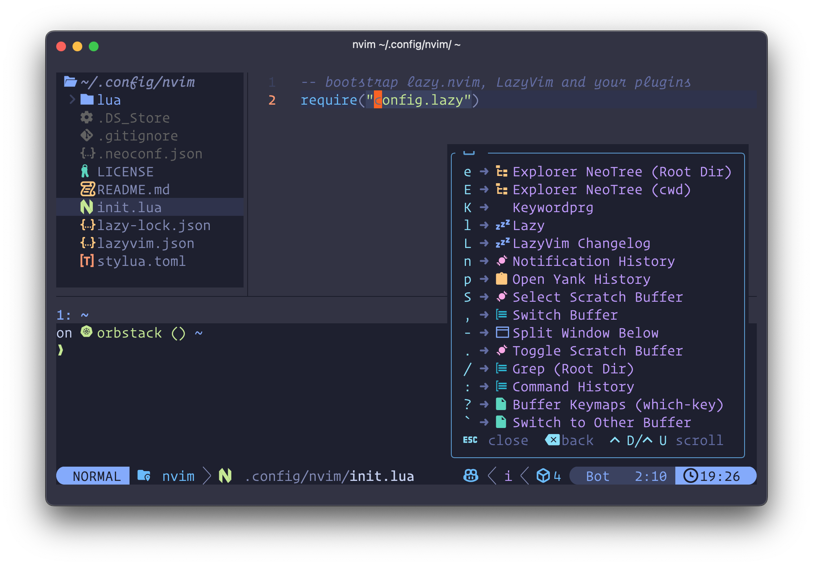

<a href="https://gitmoji.dev">
  
</a>

# Dotfiles

macOS dotfiles managed with [chezmoi](https://www.chezmoi.io).

## ✨ Highlights

- **🐚 Shell**: [Fish](https://fishshell.com/)
- **⭐ Prompt**: [Starship](https://starship.rs) with [Jujutsu](https://martinvonz.github.io/jj/) integration
- **📝 Editor**: [Neovim](https://neovim.io/) + [LazyVim](https://www.lazyvim.org/)
- **🖥️ Terminal**: [Ghostty](https://ghostty.org/)
- **🔄 Version Control**: Git + [Jujutsu](https://martinvonz.github.io/jj/)
- **🎨 Theme**: [Tokyo Night](https://github.com/folke/tokyonight.nvim)
- **🔍 Navigation**: [fzf](https://github.com/junegunn/fzf), [zoxide](https://github.com/ajeetdsouza/zoxide), [atuin](https://atuin.sh/)
- **🛠️ Quality**: [Trunk](https://trunk.io/), [prek](https://github.com/HotThoughts/prek) (pre-commit replacement)
- **📦 Packages**: Brewfile

## 🚀 Quick Start

### Prerequisites

- macOS

### Installation

```bash
# Clone and apply dotfiles
git clone https://github.com/HotThoughts/dotfiles.git ~/.local/share/chezmoi
cd ~/.local/share/chezmoi
./install.sh
```

The script installs chezmoi and runs `chezmoi init --apply`, which triggers `run_once_setup.sh.tmpl` to install Xcode tools, Homebrew, packages from Brewfile, and Fish plugins.

## 🛠️ Tools & Technologies

### Shell Environment
- **Fish** - Interactive shell
- **Starship** - Cross-shell prompt
- **Atuin** - Shell history
- **Zoxide** - Directory jumper
- **Fisher** - Fish plugin manager

### CLI Tools
- **eza** - Modern ls
- **bat** - Cat with syntax highlighting
- **ripgrep** - Fast grep
- **fd** - Fast find
- **fzf** - Fuzzy finder
- **delta** - Better git diffs
- **lazygit** / **lazyjj** - TUI for Git/Jujutsu
- **gh** - GitHub CLI

### Development
- **Neovim** - Text editor
- **tmux** - Terminal multiplexer
- **pyenv** + **poetry** - Python management
- **nvm** - Node version manager
- **OrbStack** - Docker for macOS

### Kubernetes
- **kubectl** + **kubie** - K8s CLI and context switcher
- **helm** - K8s package manager
- **k9s** - K8s terminal UI

### Code Quality
- **Trunk** - Unified linter/formatter
- **prek** - Fast, modern pre-commit hook runner (replacement for pre-commit)
- **gitleaks** / **trufflehog** - Secret detection
- **hadolint** - Dockerfile linter
- **actionlint** - GitHub Actions linter

### Window Management
- **AeroSpace** - i3-like tiling WM
- **Karabiner-Elements** - Keyboard customization
- **Raycast** - Application launcher

## 📖 Usage

### Managing Dotfiles

```bash
# See what changes would be applied
chezmoi diff

# Apply changes from source directory to home directory
chezmoi apply

# Edit a file (opens in $EDITOR, then applies on save)
chezmoi edit ~/.config/fish/config.fish

# Add a new file to chezmoi
chezmoi add ~/.config/newapp/config.toml

# Pull and apply changes from git
chezmoi update

# Check configuration health
chezmoi doctor
```

### Making Changes

1. Edit files in `~/.local/share/chezmoi/`
2. `chezmoi diff` to preview
3. `chezmoi apply` to sync
4. Commit with gitmoji

### Common Shell Abbreviations

- `k` → `kubectl`
- `kx` → `kubie ctx` (switch Kubernetes context)
- `kns` → `kubie ns` (switch namespace)
- `ls` → `eza --icons`
- `fu` → `fisher update`

## Screenshots

**Shell**: [Starship](https://starship.rs) prompt with Jujutsu integration


**Editor**: [LazyVim](https://www.lazyvim.org/) configuration



**Theme**: [Tokyo Night](https://github.com/folke/tokyonight.nvim) applied across VS Code, Neovim, Ghostty, Fish, and Obsidian.

## Development

### Code Quality

```bash
trunk check          # Run linters
trunk fmt            # Format files
trunk upgrade        # Update trunk
```

Prek runs hooks to check shell scripts, Python, Markdown, secrets, YAML/JSON/TOML, and more.

### Jujutsu Aliases

- `jj mine` - List bookmarks
- `jj tug` - Move bookmarks up
- `jj rebase-all` - Rebase onto trunk
- `wip()` / `private()` - Revsets excluded from git push

## Requirements

- macOS
- ~2GB disk space

## License

Personal dotfiles. Use as inspiration.
