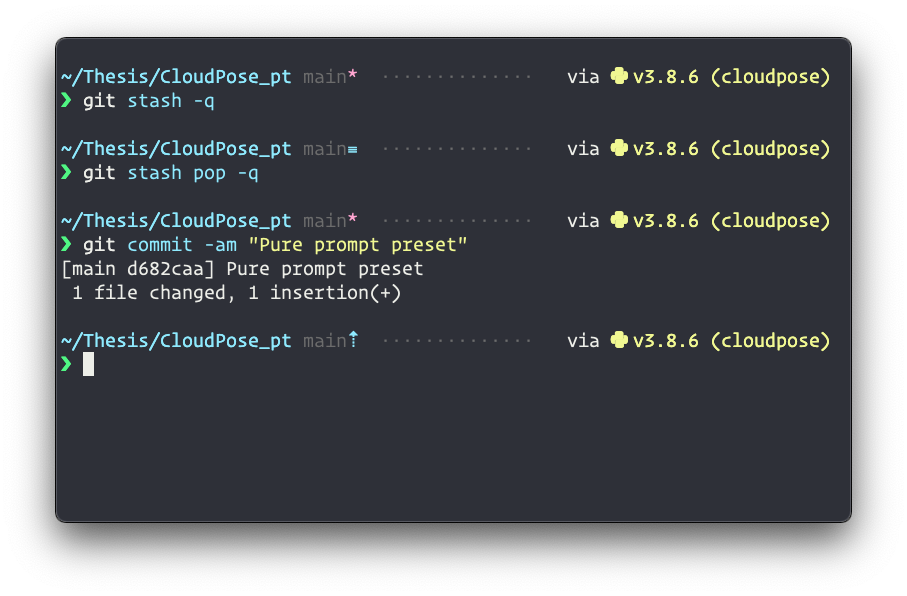
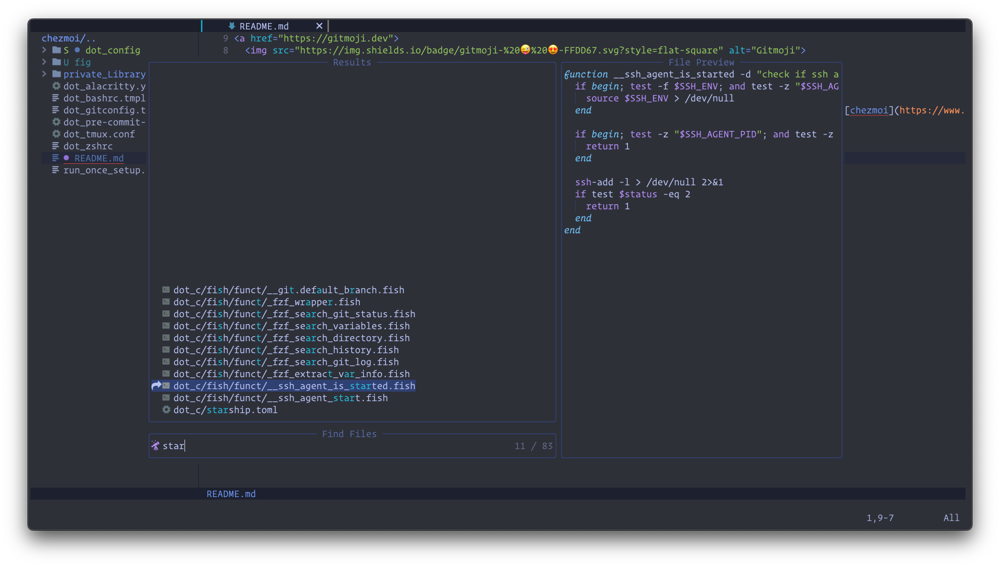

# Dotfiles

Switching from [bare-repo based](https://github.com/HotThoughts/dotfiles/tree/bare-repo) setup, I am now using [chezmoi](https://www.chezmoi.io) to manage all dotfiles and scripts.

## The shell

I really like the [Pure](https://github.com/sindresorhus/pure)'s minimalist aesthetics. Here is [Starship](https://starship.rs)'s Pure prompt preset, with additional Python version and virtualenv name on the right. With Starship, I am able to enjoy the same prompt style in *any* shell.

## The editor

I use [LunarVim](https://www.lunarvim.org/#opinionated) as my primary editor. It is a opinionated IDE layer for NeoVim. Love it.

## The theme

[Tokyo Night](https://github.com/folke/tokyonight.nvim) is my faviror theme at the moment. I have set this theme on VS Code, LunarVIM, iTerm, Obsidian, Kitty, and so on.
