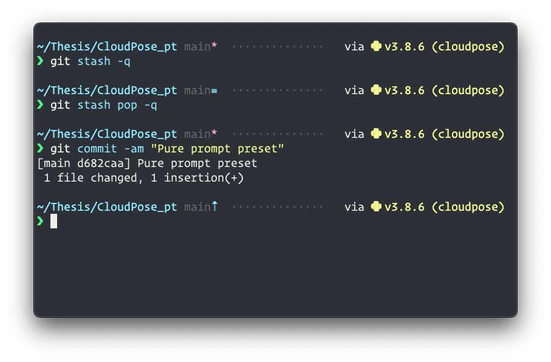
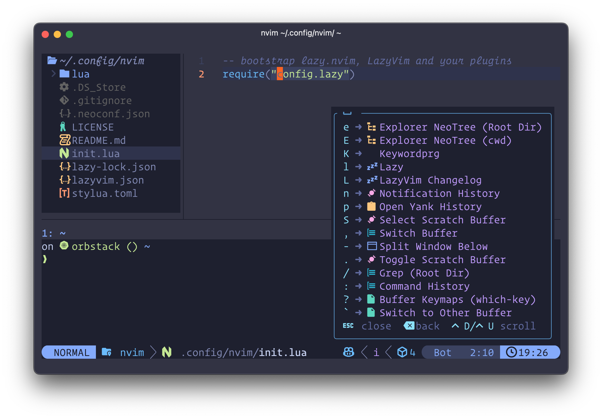

<a href="https://gitmoji.dev">
  
</a>

# Personal Dotfiles

A comprehensive dotfiles repository managed by [chezmoi](https://www.chezmoi.io), featuring modern development tools and consistent theming across environments.

## Overview

This repository contains my personal development environment configuration, migrated from a [bare-repo based setup](https://github.com/HotThoughts/dotfiles/tree/bare-repo) to chezmoi for better templating and cross-platform support.

### Key Features

- **Shell Environment**: Fish shell with Starship prompt and Pure preset
- **Version Control**: Jujutsu (jj) as primary VCS with Git fallback
- **Editor**: Neovim with LazyVim framework
- **Terminal**: Ghostty (primary) with tmux multiplexer
- **Theme**: Tokyo Night across all applications
- **Package Management**: Homebrew with comprehensive Brewfile

## Quick Start

### Installation

```bash
# Clone and bootstrap the environment
git clone <repository-url> ~/.local/share/chezmoi
cd ~/.local/share/chezmoi
./install.sh
```

### Daily Usage

```bash
# Apply configuration changes
chezmoi apply

# Edit a dotfile
chezmoi edit ~/.bashrc

# Add new files to management
chezmoi add ~/.new-config

# Check status and differences
chezmoi status
chezmoi diff
```

## Environment Details

### Shell Configuration


The shell setup features:
- **Fish Shell**: Primary shell with extensive customizations
- **Starship Prompt**: Cross-shell prompt with [Pure](https://github.com/sindresorhus/pure) preset aesthetics
- **Custom Functions**: Git workflows, Kubernetes shortcuts, and development utilities
- **FZF Integration**: Enhanced fuzzy finding across the system

### Development Environment


The development setup includes:
- **Neovim**: Configured with LazyVim framework
- **Zed Editor**: Backup editor with Vim keybindings
- **Version Control**: Jujutsu (jj) with Git integration
- **Terminal Multiplexer**: tmux with custom configuration

### System Integration

- **Window Management**: Aerospace (i3-like tiling for macOS)
- **Keyboard Remapping**: Karabiner-Elements configuration
- **Package Management**: Homebrew with automated installation
- **Cross-Platform**: Templates for different operating systems

## Theme


[Tokyo Night](https://github.com/folke/tokyonight.nvim) provides consistent theming across:
- Neovim and text editors
- Terminal applications (Ghostty, Kitty, Alacritty)
- Shell prompts and colors
- VS Code and development tools

## Structure

```
├── dot_config/           # XDG config directory (~/.config/)
│   ├── fish/            # Fish shell configuration
│   ├── nvim/            # Neovim with LazyVim
│   ├── jj/              # Jujutsu VCS config
│   └── starship.toml    # Cross-shell prompt
├── dot_*                # Dotfiles for home directory
├── private_*            # Encrypted sensitive files
├── Brewfile             # Homebrew package definitions
└── install.sh           # Bootstrap script
```

## Contributing

This is a personal dotfiles repository, but feel free to:
- Browse configurations for inspiration
- Report issues or suggest improvements
- Fork and adapt for your own use

## License

MIT License - feel free to use and modify as needed.
