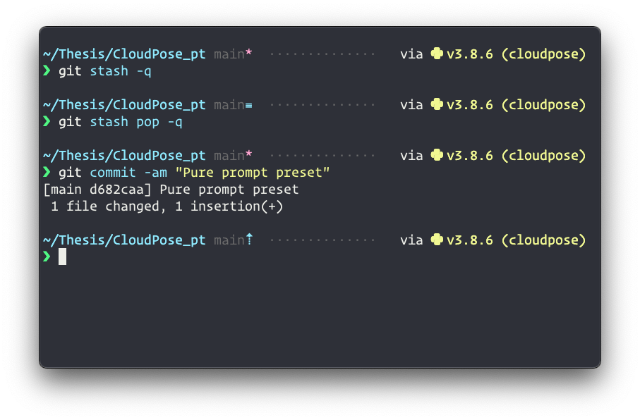
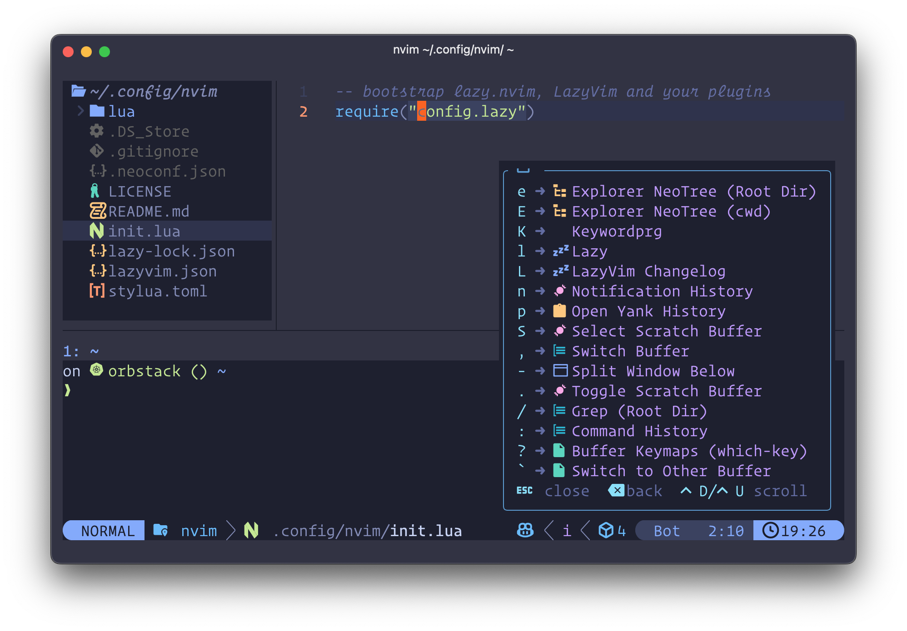

# Dotfiles

macOS dotfiles managed with [chezmoi](https://www.chezmoi.io).

This repository bootstraps a development-focused terminal environment: Fish,
Starship, Neovim/LazyVim, Ghostty, Herdr, Jujutsu, Kubernetes tooling, and a
curated Homebrew bundle.

## Highlights

- **Shell**: [Fish](https://fishshell.com/) with Fisher-managed plugins
- **Prompt**: [Starship](https://starship.rs) with
  [Jujutsu](https://martinvonz.github.io/jj/) integration
- **Editor**: [Neovim](https://neovim.io/) with
  [LazyVim](https://www.lazyvim.org/)
- **Terminal**: [Ghostty](https://github.com/ghostty-org/ghostty) and Herdr
- **Version control**: Git, [Jujutsu](https://martinvonz.github.io/jj/),
  [lazygit](https://github.com/jesseduffield/lazygit), and lazyjj
- **Theme**: Tokyo Night across the shell, editor, and terminal surfaces
- **Navigation**: [fzf](https://github.com/junegunn/fzf),
  [zoxide](https://github.com/ajeetdsouza/zoxide), Atuin, fd, and ripgrep
- **Quality**: [Trunk](https://trunk.io/), prek, actionlint, hadolint,
  gitleaks, and trufflehog
- **macOS workflow**: AeroSpace, SketchyBar, Karabiner-Elements, and Raycast

## Quick Start

### Requirements

- macOS
- `git`
- `curl` or `wget`

### Install

```bash
git clone https://github.com/HotThoughts/dotfiles.git ~/.local/share/chezmoi
cd ~/.local/share/chezmoi
./install.sh
```

`install.sh` bootstraps chezmoi from its official installer if needed, then runs
`chezmoi init --apply` against this source directory. The first initialization
prompts for Git/Jujutsu identity data. On macOS, chezmoi installs Homebrew once
and reruns package or Fish-plugin setup only when the corresponding manifest
changes. Existing Homebrew packages are not upgraded implicitly.

## What Gets Managed

### Shell

- Fish configuration, abbreviations, paths, and environment variables
- Starship prompt configuration
- Atuin history, zoxide navigation, fzf defaults, and eza aliases
- tmux and Zellij terminal multiplexing configuration

### Editors

- Neovim/LazyVim configuration and plugins
- A committed Lazy plugin lockfile for reproducible Neovim installs
- Zed settings, keymap, and tasks

### Agents

- omp (Oh My Pi) agent configuration, including vim mode

### Terminals

- Ghostty configuration
- The custom Ghostty cursor shader referenced by that configuration
- Herdr terminal workspace configuration
- Kitty and Alacritty configuration
- Tokyo Night-themed shell and terminal colors

### Version Control

- Git configuration template
- Global Git ignore rules and Git LFS support
- Jujutsu configuration, aliases, signing, and private revsets
- lazygit, lazyjj, and hunk configuration

### Kubernetes

- kubectl, kubie, helm, and k9s configuration
- k9s skins and views
- helper scripts for EKS and common Kubernetes workflows

### macOS Desktop

- AeroSpace tiling window manager configuration
- SketchyBar configuration and plugins
- Karabiner-Elements private keyboard configuration
- Raycast and related productivity apps from `Brewfile`

## Daily Usage

### Chezmoi

```bash
chezmoi diff      # Preview changes before applying them
chezmoi apply     # Apply source changes to $HOME
chezmoi edit FILE # Edit a managed file and apply it on save
chezmoi add FILE  # Add an existing local file to chezmoi
chezmoi update    # Pull the repo and apply changes
chezmoi doctor    # Check chezmoi health and environment details
```

Two repository scripts reconcile `$HOME` with source state without rendering
templates, so they keep working while a template is broken:

```bash
./scripts/sync-managed-files.sh          # Audit drift against source state
./scripts/sync-managed-files.sh --write  # Re-add clean drift
./scripts/sync-new-configs.sh            # Audit unmanaged config files
./scripts/sync-new-configs.sh --write    # Add the reviewed candidates
```

### Tool versions and updates

`Brewfile` declares the tools and `Brewfile.versions` records the versions
installed on the reference machine. The inventory makes version changes
reviewable, but it is not an exact-version lock: Homebrew generally installs
the current formula version rather than arbitrary historical versions.

To see available updates and a short overview of the latest GitHub release
without changing anything:

```bash
./scripts/check-tool-updates.sh
```

Release summaries require `gh`; tools hosted elsewhere still appear in the
version report without a summary. Skip network release lookups with
`--no-release-notes`.

After an intentional upgrade, refresh the version inventory and commit it:

```bash
brew upgrade <tool>
./scripts/snapshot-tool-versions.sh
```

tmux plugins, the Zellij status plugin, Neovim plugins, and global
agent skills are pinned independently of Homebrew. Update their recorded commit,
version, digest, or checksum explicitly and review the resulting diff.

`Operator Mono Lig`, used by Ghostty, is a licensed font and remains a manual
installation. `Brewfile` installs Hack Nerd Font for Zed's configured fallback.

### Agent instructions and skills

Chezmoi renders one shared global policy into Codex, Claude Code, and OpenCode.
Repository-specific rules live in `AGENTS.md`; `CLAUDE.md` imports them. Global
skills are source- and commit-pinned in `skills.yaml`:

```bash
./scripts/sync-skills.sh          # Read-only upstream audit
./scripts/sync-skills.sh --write  # Deliberately refresh pinned refs
./scripts/install-skills.sh       # Install the exact manifest revisions
```

The install command changes global agent state, so it is intentionally separate
from chezmoi application.

### Local Changes

1. Edit files in `~/.local/share/chezmoi`.
2. Run `chezmoi diff`.
3. Run `chezmoi apply`.
4. Commit the change.

### Common Fish Abbreviations

| Abbreviation | Expands to       | Purpose                     |
| ------------ | ---------------- | --------------------------- |
| `k`          | `kubectl`        | Kubernetes CLI              |
| `kx`         | `kubie ctx`      | Switch Kubernetes context   |
| `kns`        | `kubie ns`       | Switch Kubernetes namespace |
| `ls`         | `eza --icons`    | Modern directory listing    |
| `n`          | `nvim`           | Open Neovim                 |
| `cu`         | `chezmoi update` | Update and apply dotfiles   |
| `fu`         | `fisher update`  | Update Fish plugins         |

## Development Workflow

```bash
bash tests/run.sh     # Focused bootstrap, render, wrapper, and sync tests
prek run --all-files # The same repository hooks used by CI
trunk check           # Additional linting
trunk fmt             # Formatting
trunk upgrade         # Update Trunk plugins
```

Prek is configured as a fast pre-commit replacement for shell scripts, Python,
Markdown, YAML, JSON, TOML, secret scanning, and related checks. GitHub Actions
runs the focused test suite and all prek hooks on pushes and pull requests.

### Jujutsu Shortcuts

| Alias           | Description                                           |
| --------------- | ----------------------------------------------------- |
| `jj mine`       | List bookmarks owned by the current user              |
| `jj tug`        | Move the closest bookmark to the closest pushable rev |
| `jj rebase-all` | Rebase mutable local work onto trunk                  |
| `jj prek`       | Run prek against files changed in the current change  |
| `jj push`       | Run checks, then push                                 |
| `jj push-pr`    | Run checks, then create or update a pull request      |

Commits whose descriptions start with `wip:` or `private:` are excluded from
git push through the configured private revsets.

## Screenshots

**Shell**: Starship prompt with Jujutsu integration.



**Editor**: LazyVim configuration.



**Theme**: Tokyo Night applied across VS Code, Neovim, Ghostty, Fish, and
Obsidian.

## License

Personal dotfiles. Use as inspiration.
